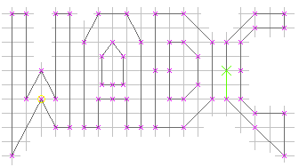

= WadC ("Wad Compiler")
Jonathan Dowland <jon@dow.land>
:homepage: https://jmtd.net/wadc/

== About

WadC is a programming language and IDE for the construction of Doom maps.

WadC is a lazy functional/macro hybrid programming language. Think of it
like https://en.wikipedia.org/wiki/Logo_(programming_language)[Logo] on
steroids, with monsters.

See the WadC homepage: <https://jmtd.net/wadc/>.

== Documentation

 * link:doc/setup.adoc[Setup and getting started]
 * link:doc/reference.adoc[Complete reference]
 * link:doc/release_notes.adoc[Release notes and version history]
 * link:doc/tutorial.adoc[Incomplete tutorial (work in progress)]
 * link:https://redmars.org/wadc/examples/[Examples gallery] (external)

It's also worth reading the link:examples/[] and
link:include/[standard library].

== Download

Downloads are on the https://github.com/jmtd/wadc/releases[GitHub releases page].

== Who

Since 2008, WadC is developed by link:https://jmtd.net[Jonathan Dowland].

WadC was originally written by Wouter van Oortmerssen
(link:http://strlen.com/wadc/[Aardappel]) in 2001.

== License

WadC is licensed under the terms of link:LICENSE.txt[the GNU Public License,
version 2].

WadC uses the Picocli Java library, which is licensed under
link:doc/Apache-License-2.0.txt[the Apache License, version 2.0].
