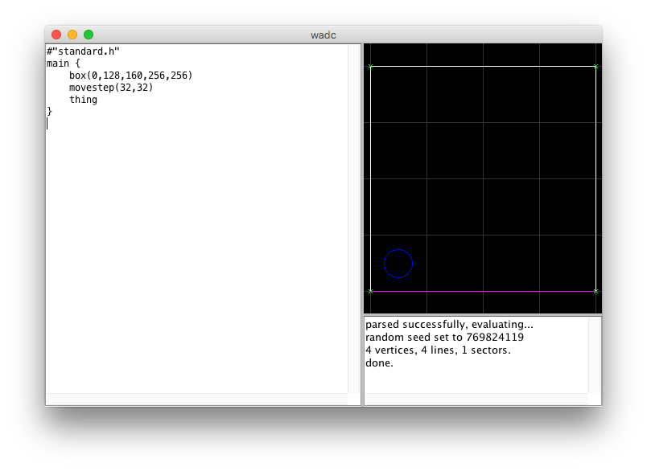
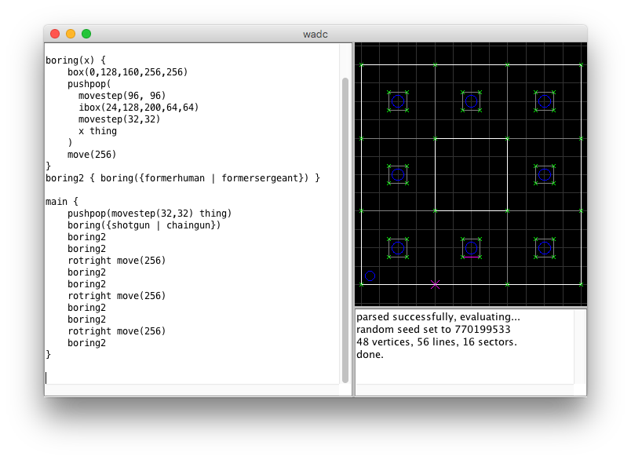

= WadC tutorial
Jonathan Dowland <jon@dow.land>
:homepage: https://jmtd.net/wadc/

This tutorial hopes to walk you through WadC. We start with the very basics
and drawing some very simple, boring square rooms. By the end I hope we are
generating some intricate dungeons in the style of an old board game I used
to love called "Warhammer Quest", complete with some randomness to make the
resulting map different every time you build it.

== Set up

Make sure you have the WadC JAR somewhere and have Java installed. You need
at least version 8. To test, try double-clicking on the JAR: If WadC appears,
success! If not, you probably haven't got Java on properly.

You will also need a Doom engine, a Doom IWAD (game data), and a nodes
builder. Use your favourite, otherwise I recommend:

Java JRE:: link:http://openjdk.java.net/install/[via OpenJDK]
Engine:: link:https://www.chocolate-doom.org/wiki/index.php/Crispy_Doom#Download[Crispy Doom]
IWAD:: link:https://www.gog.com/game/doom_ii_final_doom[Doom 2 via GOG.com]
Node builder:: link:http://glbsp.sourceforge.net[glbsp]

Put them all somewhere and let WadC know where they are via the Preferences
dialogue.

== High-level overview

Imagine a big piece of graph paper and a pen. There's a robotic arm holding the
pen over the graph paper. You can tell the arm to move up or down, to the left
or to the right. You can tell the arm to raise or lower the pen from the paper.
You can tell the arm to swap the pen for one of another colour. You can tell
the arm to rotate by 90 degrees either to the left or to the right; such that
the new forwards/upwards direction is what was formerly left/right.

This is a little bit like the old educational tool LOGO: where the robotic arm
was called a "Turtle".  For WadC, we'll call it the cursor.

In WadC, you can move the cursor up, down, to the left or right; you can rotate
by 90 degrees in either direction; you can move the "pen" up or down,
controlling whether you are drawing lines or just moving about. The WadC
equivalent of "pen colour" is a set of properties about the objects that will
be created by your instructions, including what floor and ceiling texture to
use when creating sectors; what textures to use when creating lines; what type
of things to create when creating things; what properties for those things, or
lines, including tags and special types such as doors and buttons.

We can also group together sets of these instructions into bundles called
functions, you can refer to those functions to execute all the steps within,
letting you repeat things easily. You can also leave placeholders within the
functions that are filled in when you refer to them. WadC comes with lots of
existing functions that help you to work at a higher conceptual level than
"pen up, pen down".

== Hello world

The very first thing we will try is perhaps the simplest possible functional
WadC level: a box with the player in it. Consider this the WadC equivalent of
"Hello world":

.tutorial/1.wl
----
include::tutorial/1.wl[]
----

The very first line tells WadC to include the library file "standard.h". If you
have ever programmed in a mainstream language before, you may have seen things
like this elsewhere, such as C's `#include` or `import` in Python, etc.

We have defined a function called "main". This is the entry point into your
WadC program. We call three functions within it: box, which draws a box room;
movestep, which moves the "pen", and thing, which creates a thing wherever the
cursor is.

Try it out. You can probably figure out what the arguments to box and movestep
are, especially if you run the resulting WAD.

`box` and `movestep` are all defined within `standard.h`, by the way.

Notice that we haven't had to think about whether the cursor is up or down, the
details of that are hidden away within the definitions for `box` and `movestep`.
We also haven't had to decide on textures for walls or floors, or specifically
ask for a player 1 start thing. We're relying on WadC's default values.

== User-defined functions, pushpop

Where do we go from here? Let's make a few tweaks to this boring level.

.tutorial/2.wl
----
include::tutorial/2.wl[]
----

Here we've defined a second function called `boring`. We've moved the call to
`box` into it, and we're now calling boring from within main.

If you try building this, you will end up with exactly the same map as before.
Not too exciting yet!

What happens if we try calling `boring` twice?

.tutorial/3.wl
----
include::tutorial/3.wll[]
----

It didn't work: the second box is trying to overdraw on the first. We can fix
this by adding a `move`, to move the cursor onwards after the `box`:

.tutorial/4.wl
----
include::tutorial/4.wl[]
----
image::tutorial/4.png[title="4.wad"]

Et voila, two boring rooms instead of one! However, where is the player start?
It's a bit weird to be putting the player start in last. Instead, let's place
it first

.tutorial/5.wl
----
include::tutorial/5.wl[]
----

The player is now stuck in the corner of the first room. We're moving the
cursor, placing the player, but then drawing onwards from that same point. We
need to temporarily move into the space the room will occupy, place the player,
and move back.

.tutorial/6.wl
----
include::tutorial/6.wl[]
----

Great, that works. This is something that has to be done so frequently,
there's a function in `standard.h` to help you do it:

.tutorial/7.wl
----
include::tutorial/7.wl[]
----

If you've ever programmed in a C or C-like language, this may look a bit
strange to you. What argument are we passing `pushpop`? Where did the second
`movestep` go? This demonstrates two things

 * After it has been evaluated, `pushpop` returns the cursor to the position
   it was in when it started. So the second `movestep` isn't necessary. We
   could move the cursor wherever we liked and it would be back at the
   beginning after `pushpop` was done.

 * Any function argument in WadC can contain multiple expressions. Any sequence
   of expressions next to each other are concatenated into one.

== Things to do

Let's liven up the box a bit: let's put a pedestal in the middle and add
something to do (or shoot).

.tutorial/8.wl
----
include::tutorial/8.wl[]
----
image::tutorial/8.png[title="8.wad"]

We introduce a new function `ibox`, which works just like `box`, except it
creates an _inner_ box, with the outer edges of the linedefs belonging to
the outer sector.

We see `thing` again, but this time preceded by `formerhuman`. The first
time we used `thing`, a player 1 start was created: that's the default
thing if nothing else is specified. `formerhuman` changes the thing type
to a zombieman.

== Different pedestals

Let's make each pedestal have a different thing on it.

.tutorial/9.wl
----
include::tutorial/9.wl[]
----

Here we've introduced arguments for our `boring` function. So far, we've
written two functions (`main` counts) but none of them accepted any
arguments. We've used plenty of other functions that accepted arguments.
Now we know how to write them.

We've had to add `pickups.h` to the list of includes at the top in order
to get access to the `shotgun` definition.

== Some randomness

Let's make things more unpredictable by introducing the choice operator.

.tutorial/10.wl
----
include::tutorial/10.wl[]
----

Now we get either a shotgun or a chaingun, and must face either a
zombieman or a shotgun guy.

The braces ({}) are not strictly necessary here but they might be needed
in other places where you might want to use the choice operator; until
you understand WadC better it's best to just use them all the time.

== Turning corners

We can use these buildings blocks to assemble a ring of rooms quite easily.

.tutorial/11.wl
----
include::tutorial/11.wl[]
----

Here we introduce `rotright`. It and its sibling `rotleft` simply rotate
the cursor 90 degrees one way or the other. To think, we've come this far
without covering turning around yet!

We also use a third function to encapsulate our choice of random monsters.

The script is starting to look a bit ugly, with lots of repetition. Let's
tidy it up.

.tutorial/12.wl
----
include::tutorial/12.wl[]
----

What have we done here? Firstly, we made the decision to move your random
weapon off a pedestal and just put it at your feet at the start of the map.
Once we had done that, we started to have a repeating pattern of functions

 boring2
 boring2
 rotright
 move(256)

The `standard.h` header has a number of simple functions to aid with managing
repeating code like this. Here we use `twice`, er, twice, and `triple` once.

The use of the `twice` within the `triple` is possibly a bit over the top.
Sometimes you have to make a judgement call as to whether it helps or hinders
legibility. Which do you think is easier to read?

    triple(boring2 boring2 rotright move(256))
    triple(twice(boring2) rotright move(256))

We've also re-arranged the order of the boring rooms slightly. You may notice
that the starting room is now in the "West" position rather than the "South
West".

== Now for a corridor

Let's try another routine. First of all, can you remember where the cursor is?
I can't. If you are using the WadC GUI, a quick way to find out is to put a
temporary thing at the end of the script, or to add a short wall that goes
nowhere. Try adding `thing` and/or `straight(64)` right at the end of the
`main` function and look at the result in the GUI. Is it clearer?

Let's try adding a new type of room to the map. Considering that the existing
rooms are 256x256 squares, and that the cursor is generally positioned in the
top-leftmost point of each room after we've drawn it using `boring`. Let's
define a corridor that doesn't extend from that corner but from a way into
the square room.

.tutorial/13.wl
----
include::tutorial/13.wl[]
----
image::tutorial/13.png[title="13.wad"]

Before drawing the corridor, we first move inwards a bit, because we want the
corridor inset. Just as with the `boring` routine, we then move outwards again,
so we're positioned ready to call one of our routines straight away.

I've tacked a final `boring2` on the end just so you can see that things all
line up.

== Older tutorial stuff to integrate into the above narrative

Works now.  Another room type, a bend

 leftturn {
     movestep(96,96)
     turnaround
     box(0,128,128,96,64)
     movestep(0,64)
     box(0,128,128,64,32)
     rotright
     movestep(32,-96)
 }

dev tip: when developing something like this, if you get lost, 
try putting straight(64) in places to see where the cursor is
at that point in time

time for randomroom!

 randomroom {
     boring | corridor | leftturn
 }

try chaining it!

 main {
     for(1, 5, randomroom)
 }

refresh a load of times.  eventually, you will hit a situation where one
of the rooms tries to draw into the space occupied by another.

let's review our "contract" for these rooms:

 * each room draws from bottom-left and puts cursor in place for next block
   to be run immediately after
 * each room self contained in 128x128

(we also need to agree on where the join points are. this is a bit loose.)

we need to implement a blockmap:
2d coordinate of 128x128 blocks, (x,y) starting 0,0 and growing vertically/right

each room will check to see whether the 'block' it's going into is occupied
or not, and either bail out, or draw and then mark that block as occupied

(at this point look at lisp.wl in examples; this will be a building block for
our blockmap)
